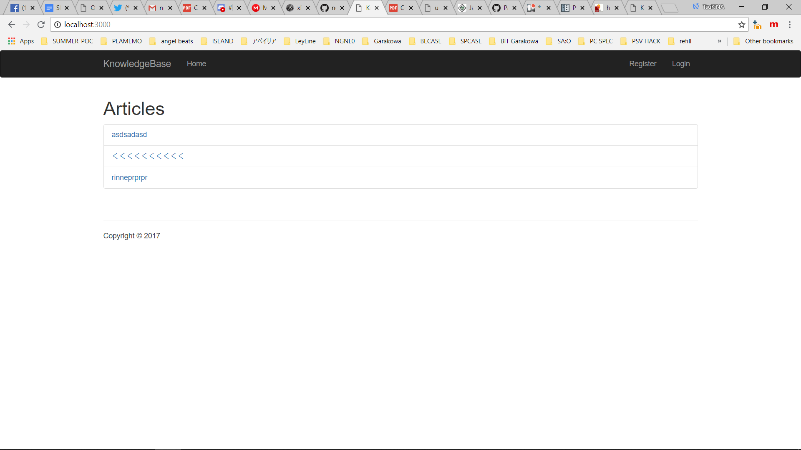
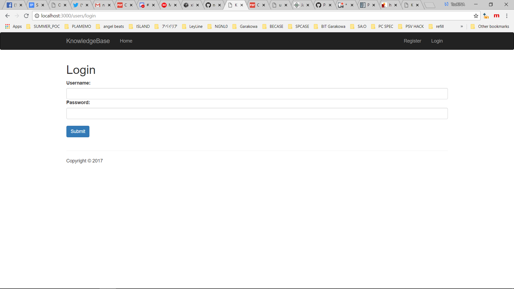
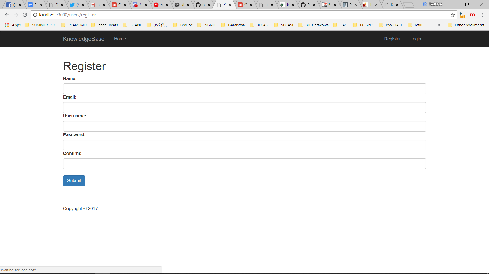
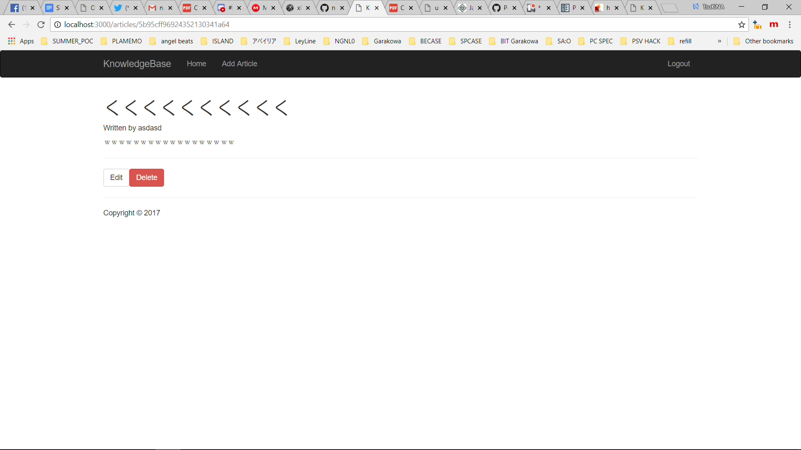

# Assignment 08: Article Website with Nodejs, Mongoose (MongoDB), Pug web Engine

#### Please config your data base in ./config/database.js before run app

#### These are the screenshots

##Install&Run
Run installLib (take a min)
Run run(app.js)